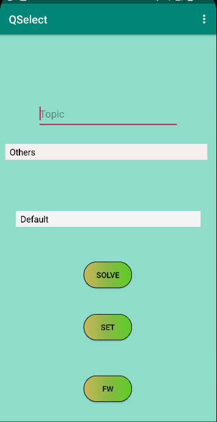
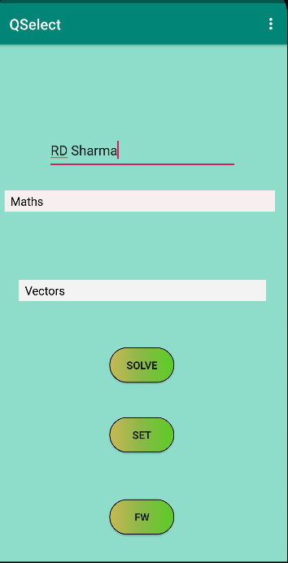
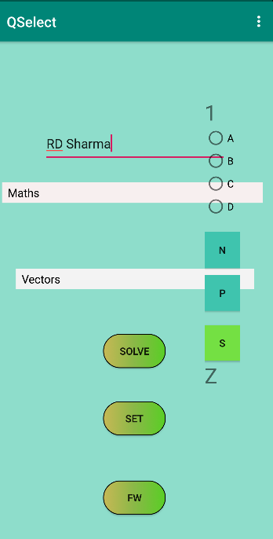
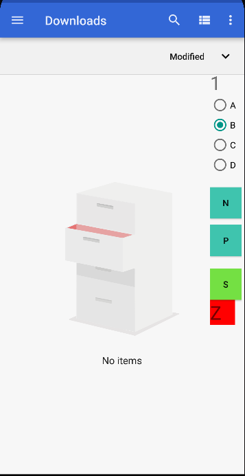
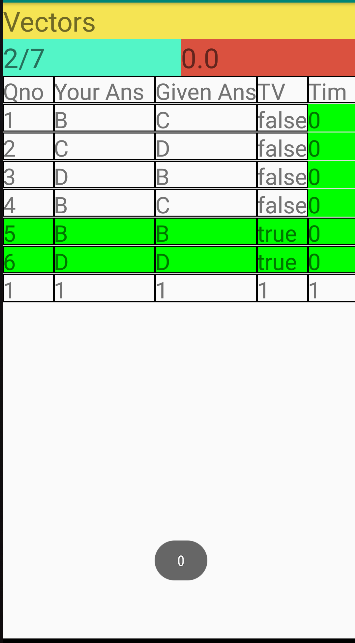
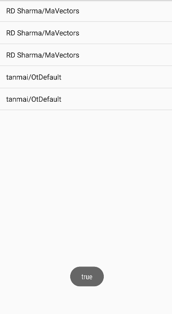

# QSel
 Qsel is my First Created App for use.
This is my first android project i created and used for my preparation of JEE and CET. This provides easy solving,checking and logging mechanisms for all quest solved.
It provides floating window while solving that is used to mark ans, mark doubtful quest, and also provides inbuilt timer.

### First Image
* show landing page of the app
* Solve : used to solve by students
* Select : Used to set correct ans for questions
* FW : Checking and Evaluation

### Fourth Image 

* Shows the hovering floating window
* Z is indicator for Doubt selection
* and Number is question number

## Fifth Image

* It is result page and we Can see every thing right from score , doubt, avg time, time for each quesion ,etc

